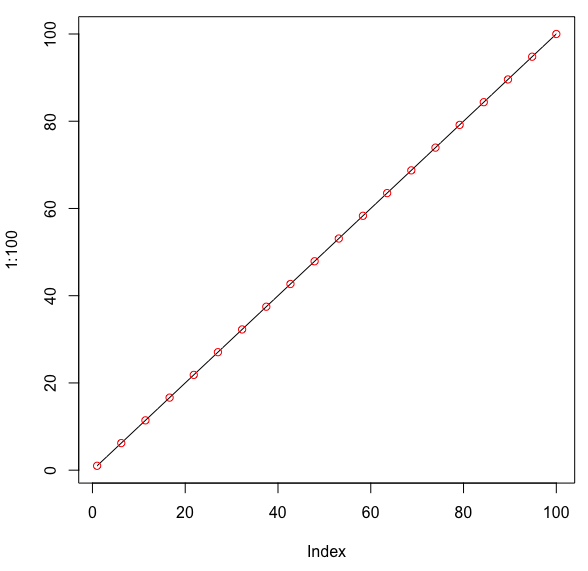
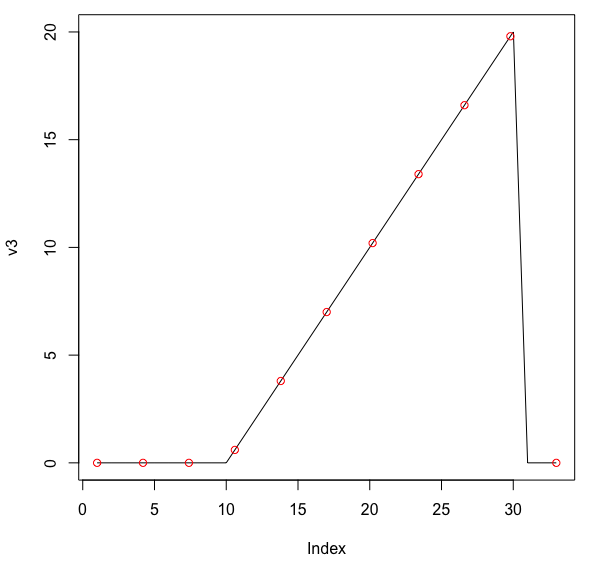
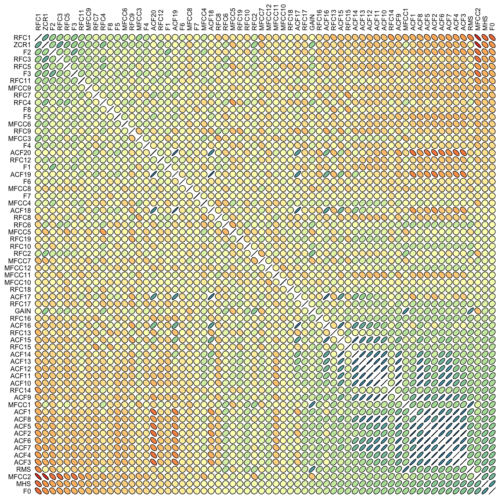
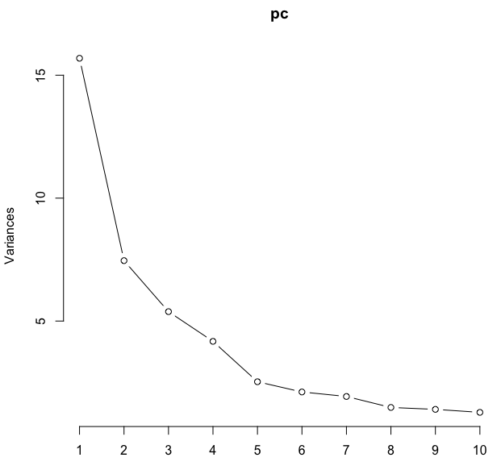
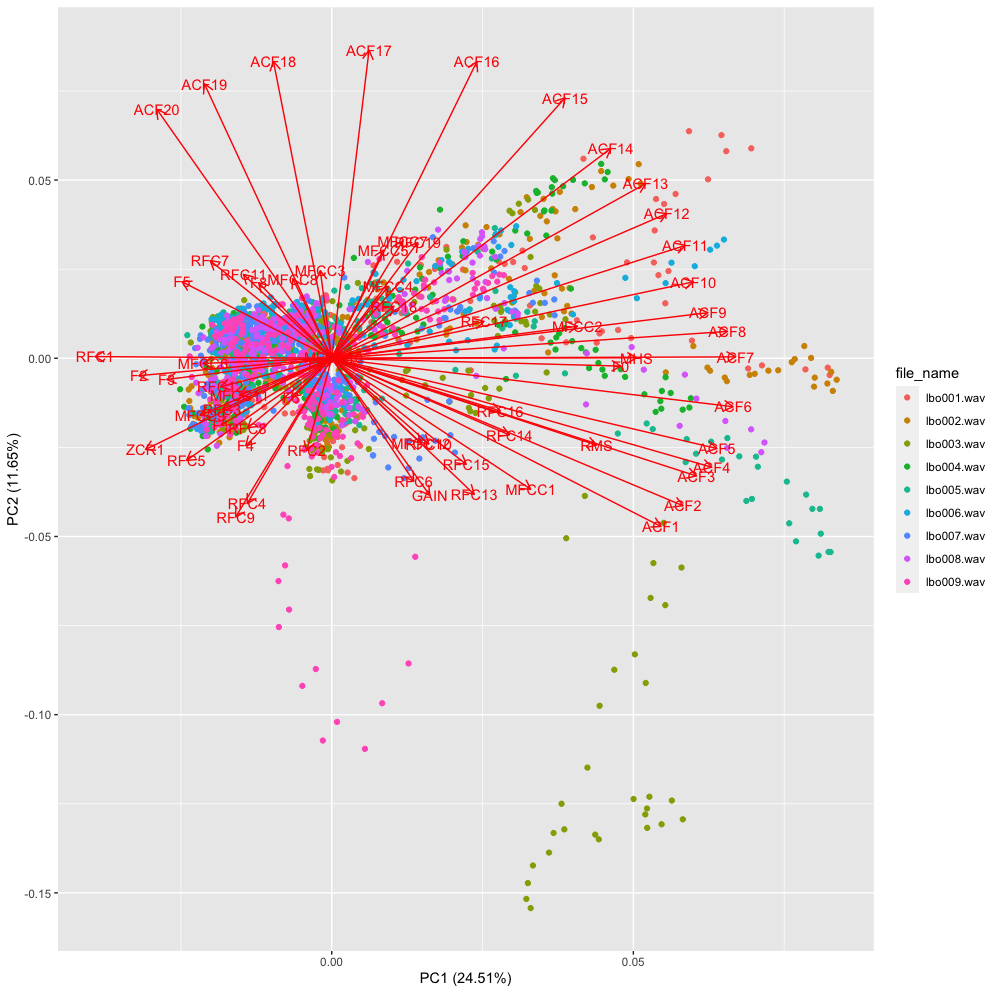

# `voice`

<!-- badges: start -->
[](https://github.com/filipezabala/voice/actions?workflow=R-CMD-check)
<!-- badges: end -->

General tools for voice analysis. The `voice` package is being developed to be an easy-to-use set of tools to deal with audio analysis in R. It is based on [`tidyverse`](https://www.tidyverse.org/) collection, [`tuneR`](https://cran.r-project.org/web/packages/tuneR/index.html), [`wrassp`](https://cran.r-project.org/web/packages/wrassp/index.html), as well as [Parselmouth](https://github.com/YannickJadoul/Parselmouth) - a Python library for the [Praat](http://www.praat.org/) software - and [pyannote-audio](https://github.com/pyannote/pyannote-audio) - an open-source toolkit written in Python for speaker diarization based on [PyTorch](https://github.com/pytorch/pytorch) machine learning framework. 

## Installation
The following steps were used to configure gitHub.com/filipezabala/voice in a [MacOS Big Sur](https://www.apple.com/macos/big-sur/). Note the versions during the installation. If the error "The package %@ is missing or invalid" appears during the upgrading from MacOS Catalina to Big Sur, press simultaneously `command + option + p + r` at restart). The processes may be accompanied using command + space 'Activity Monitor'.  

Hardware  
 . MacBook Air (13-inch, 2017)  
 . Processor 1.8 GHz Dual-Core Intel Core i5  
 . Memory 8GB 1600 MHz DDR3  
 . Graphics Intel HD Graphics 6000 1536 MB  

### 1. Install [`Homebrew`](https://brew.sh/)
Install Homebrew, 'The Missing Package Manager for macOS (or Linux)'. Remember to `brew doctor` eventually. At terminal run:

```bash
/bin/bash -c "$(curl -fsSL https://raw.githubusercontent.com/Homebrew/install/HEAD/install.sh)"
sudo chown -R $(whoami) /usr/local/lib/pkgconfig /usr/local/share/info /usr/local/share/man/man3 /usr/local/share/man/man5
chmod u+w /usr/local/lib/pkgconfig /usr/local/share/info /usr/local/share/man/man3 /usr/local/share/man/man5
```

### 2. Install [`wget`](https://www.gnu.org/software/wget/)
```bash
brew install wget
```

### 3. Install [`Python`](https://www.python.org/)
According to [this](https://github.com/Homebrew/homebrew-core/issues/62911) post, it is recommended to install Python 3.8 and 3.9 and make it consistent. May take several minutes.

```bash
brew install python@3.8
brew install python@3.9
brew unlink python@3.9
brew unlink python@3.8
brew link python@3.8
python3 --version 
pip3 --version
```

### 4. Install [`ffmpeg`](http://ffmpeg.org/)
May take several minutes.

```bash
brew install ffmpeg
```

### 5. Install [`XQuartz`](www.xquartz.org).
 . Download https://github.com/XQuartz/XQuartz/releases/download/XQuartz-2.8.1/XQuartz-2.8.1.dmg.
 . Double click XQuartz-2.8.1.dmg
 . Will take 319.2 MB of disk space. 
 . Send XQuartz-2.8.1.dmg to Trash.

### 6. Install [`bwidget`](http://sourceforge.net/projects/tcllib/files/)
 . Download https://sourceforge.net/projects/tcllib/files/latest/download

```bash
cd ~/Downloads
tar -xf bwidget-1.9.14.tar.gz
mv bwidget-1.9.14 /usr/local/lib/bwidget-1.9.14
```

### 7. Install [`R`](https://www.r-project.org)
 . Download https://cloud.r-project.org/bin/macosx/base/R-4.1.0.pkg
 . Will take 174.8 MB of disk space.
 . Send R-4.1.0.pkg to Trash.

### 8. Install [`RStudio`](https://www.rstudio.com/)
 . Download https://download1.rstudio.org/desktop/macos/RStudio-1.4.1717.dmg
 . Drag RStudio to Applications folder. 
 . Will take 768.4 MB of disk space. 
 . Unmount RStudio virtual disk and send RStudio-1.4.1717.dmg to Trash.
 . Type command + space 'rstudio'.
 . Tools > Global Options... > Appearance > Merbivore (Restart required)

### 9. Install `R` packages
 . Type command + space 'terminal'.
 
```bash
sudo R
```

Running R as super user, paste the following:
```r
ini <- Sys.time()
packs <- c('devtools', 'e1071', 'ellipse', 'ggfortify', 'RColorBrewer', 'reticulate', 'R.utils', 'seewave', 'tidyverse', 'tuneR', 'VIM', 'wrassp')
install.packages(packs, dep = T); Sys.time()-ini
update.packages(ask = F); Sys.time()-ini
devtools::install_github('cran/parallelSVM'); Sys.time()-ini
devtools::install_github('filipezabala/voice', force = T); Sys.time()-ini
```

### 10. Install [`Miniconda`](https://docs.conda.io/en/latest/miniconda.html)
Miniconda is a free minimal installer for conda.

```bash
cd ~/Downloads
wget -r -np -k https://repo.anaconda.com/miniconda/Miniconda3-latest-MacOSX-x86_64.sh
cd repo.anaconda.com/miniconda/
bash Miniconda3-latest-MacOSX-x86_64.sh
conda create -n pyvoice38 python=3.8
conda activate pyvoice38
pip3 install -r https://raw.githubusercontent.com/filipezabala/voice/master/requirements.txt
```


## Examples
### `rm0`
Transforms `n` sets of `m>n` zeros (alternated with sets of non zeros) into `n` sets of `n` zeros.
```r
library(voice)

(v0 <- c(1:20,rep(0,10)))
(r0 <- rm0(v0))
length(v0)
length(r0)
sum(v0 == 0)

(v1 <- c(rep(0,10),1:20))
(r1 <- rm0(v1))
length(r1)

(v2 <- rep(0,10))
(r2 <- rm0(v2))
length(r2)

(v3 <- c(0:10))
(r3 <- rm0(v3))
length(r3)

(v4 <- c(rep(0,10), 1:10, rep(0,5), 10:20, rep(0,10)))
(r4 <- rm0(v4))
length(r4)
sum(v4 == 0)
```
### `conv`
Convolute vectors.
```r
library(voice)

(c1 <- conv(1:100, compact.to = 0.2, drop.zeros = TRUE))
length(c1$y)
plot(1:100, type = 'l')
points(c1$x, c1$y, col='red')
```

```r
(v2 <- c(1:5, rep(0,10), 1:10, rep(0,5), 10:20, rep(0,10)))
length(v2)
conv(v2, 0.1, drop.zeros = TRUE, to.data.frame = FALSE)
conv(v2, 0.1, drop.zeros = TRUE, to.data.frame = TRUE)
conv(v2, 0.2, drop.zeros = TRUE)
conv(v2, 0.2, drop.zeros = FALSE)

(v3 <- c(rep(0,10), 1:20, rep(0,3)))
(c3 <- conv(v3, 1/3, drop.zeros = FALSE, to.data.frame = FALSE))
lapply(c3, length)
plot(v3, type = 'l')
points(c3$x, c3$y, col = 'red')

(v4 <- c(rnorm(1:100)))
(c4 <- conv(v4, 1/4, round.off = 3))
```


### `conv_mc`
Convolute vectors using multicore.
```r
library(voice)

# Same result of conv() function if x is a vector
conv(1:100, compact.to = 0.1, drop.zeros = TRUE, to.data.frame = FALSE)
conv_mc(1:100, compact.to = 0.1, drop.zeros = TRUE, to.data.frame = FALSE)

conv(1:100, compact.to = 0.1, drop.zeros = TRUE, to.data.frame = TRUE)
conv_mc(1:100, compact.to = 0.1, drop.zeros = TRUE, to.data.frame = TRUE)

# get path to audio file
path2wav <- list.files(system.file('extdata', package = 'wrassp'),
pattern <- glob2rx('*.wav'), full.names = TRUE)

# getting all the 1092 features
ef <- extract_features(dirname(path2wav), features = c('f0','formants',
'zcr','mhs','rms','gain','rfc','ac','cep','dft','css','lps','mfcc'),
mc.cores = 1)

ef.num <- ef[-1]
nrow(ef.num)
cm1 <- conv_mc(ef.num, compact.to = 0.1, drop.zeros = TRUE,
to.data.frame = FALSE, mc.cores = 1)
names(cm1)
lapply(cm1$f0, length)
```
### `conv_df`
Convolute data frames using multicore.
```r
library(voice)

# get path to audio file
path2wav <- list.files(system.file('extdata', package = 'wrassp'),
pattern <- glob2rx('*.wav'), full.names = TRUE)

# getting all the 1092 features
ef <- extract_features(dirname(path2wav), features = c('f0','formants',
'zcr','mhs','rms','gain','rfc','ac','cep','dft','css','lps','mfcc'),
mc.cores = 1)

(cef.df <- conv_df(ef, 0.1, id = 'file_name', mc.cores = 1))
(cef.df2 <- conv_df(ef, 0.1, id = 'file_name', drop.x = TRUE, mc.cores = 1))

dim(ef)
dim(cef.df)
dim(cef.df2)
(cef.list <- conv_df(ef, 0.1, id = 'file_name', to.data.frame = FALSE, mc.cores = 1))
```
### `extract_features`
Extract features from WAV files using `tuneR` and `wrassp` functions.
```r
library(voice)

# get path to audio file
path2wav <- list.files(system.file('extdata', package = 'wrassp'),
                       pattern <- glob2rx('*.wav'), full.names = TRUE)

# getting all the 1092 features
ef <- extract_features(dirname(path2wav), features = c('f0','formants',
                       'zcr','mhs','rms','gain','rfc','ac','cep','dft',
                       'css','lps','mfcc'), mc.cores = 1)
dim(ef)
ef

# using the default, i.e., not using 'cep','dft','css' and 'lps' (4*257 = 1028 columns)
ef2 <- extract_features(dirname(path2wav), mc.cores = 1)
dim(ef2)
ef2
table(ef2$file_name)

# limiting filesRange
ef3 <- extract_features(dirname(path2wav), filesRange = 3:6, mc.cores = 1)
dim(ef3)
ef3
table(ef3$file_name)

# calculating correlation of ef2
data <- cor(ef2[-1])

# pane with 100 colors using RcolorBrewer
my_colors <- RColorBrewer::brewer.pal(5, 'Spectral')
my_colors <- grDevices::colorRampPalette(my_colors)(100)

# ordering the correlation matrix
ord <- order(data[1, ])
data_ord <- data[ord, ord]
ellipse::plotcorr(data_ord , col=my_colors[data_ord*50+50] , mar=c(1,1,1,1))
```

```r
# Principal Component Analysis (PCA)
(pc <- prcomp(na.omit(ef2[-1]), scale = TRUE))
stats::screeplot(pc, type = 'lines')
```

```r
library(ggfortify)
ggplot2::autoplot(pc, data = na.omit(ef2), colour = 'file_name',
                  loadings = TRUE, loadings.label = TRUE)
```


### `extract_features_py`
Extract features from WAV files using Python's `parselmouth`.
```r
library(voice)

path2wav <- list.files(system.file('extdata', package = 'wrassp'),
                       pattern <- glob2rx('*.wav'), full.names = TRUE)
efp <- extract_features_py(dirname(path2wav))
efp
table(efp$file_name)

# limiting filesRange
efpl <- extract_features_py(dirname(path2wav), filesRange = 3:6)
efpl
table(efpl$file_name)
```
<!-- badges: start -->
[](https://github.com/filipezabala/voice/actions)
<!-- badges: end -->
