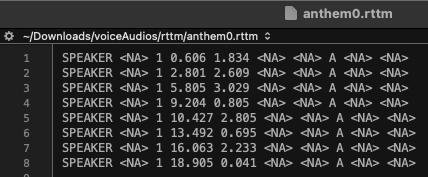
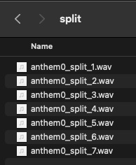

```{r setup, include = FALSE}
knitr::opts_chunk$set(
  collapse = TRUE,
  comment = "#>"
)
```

## Installation
https://github.com/filipezabala/voice

## Example 1
Find frequencies, notes and durations. Play and get sheet music.  

### Load packages
```{r, message=FALSE, warning=FALSE}
# packs
library(voice)
library(tidyverse)
library(music)
library(gm)
```
### Set directories
The `mp3` and `split` directories will be used in Example 2.
```{r}
vaDir <- '~/Downloads/voiceAudios'
wavDir <- paste0(vaDir, '/wav')
mp3Dir <- paste0(vaDir, '/mp3')
rttmDir <- paste0(vaDir, '/rttm')
splitDir <- paste0(vaDir, '/split')
mxmlDir <- paste0(vaDir, '/musicxml')
ifelse(!dir.exists(vaDir), dir.create(vaDir), 'Directory exists!')
ifelse(!dir.exists(wavDir), dir.create(wavDir), 'Directory exists!')
ifelse(!dir.exists(mp3Dir), dir.create(mp3Dir), 'Directory exists!')
ifelse(!dir.exists(rttmDir), dir.create(rttmDir), 'Directory exists!')
ifelse(!dir.exists(splitDir), dir.create(splitDir), 'Directory exists!')
ifelse(!dir.exists(mxmlDir), dir.create(mxmlDir), 'Directory exists!')
```

### Get audios
```{r}
url0 <- 'https://github.com/filipezabala/voiceAudios/raw/main/wav/bebezinho_2.005.wav'
download.file(url0, paste0(wavDir, '/bebezinho_2.005.wav'), mode = 'wb')
```
### Extract features
```{r}
ef <- voice::extract_features(wavDir, features = c('f0','formants','gain'),
                              round.to = 6, windowShift = 5)
ef
```
### Pooling
```{r}
(ef01 <- voice::conv_df(ef, .01)) # 1%
```

### Assign notes
```{r}
spn <- lapply(ef01[2:10], voice::notes)
spn <- bind_rows(spn)
colnames(spn) <- paste0('spn_', colnames(spn))
ef01 <- bind_cols(ef01, spn)

midi <- lapply(ef01[2:10], voice::notes, method = 'midi')
midi <- bind_rows(midi)
colnames(midi) <- paste0('midi_', colnames(midi))
ef01 <- bind_cols(ef01, midi)
glimpse(ef01)
```

### Distance (in semitones)
```{r}
nd.spn <- music::noteDistance(as.character(ef01$spn_F0))
table(nd.spn) # semitones
```

### Get duration
```{r}
dur.spn <- voice::duration(ef01$spn_F0)
dur.midi <- voice::duration(ef01$midi_F0)
```

### Play
```{r}
music::playNote(note = as.character(dur.spn$note),
                duration = dur.spn$dur_line)
```

### Music sheet
```{r}
m <- gm::Music()
m <- m +
  # add a 4/4 time signature
  gm::Meter(4, 4) +
  # manually adding midi notes
  gm::Line(pitches = list(51, 53, 61, 58),
       durations = list(1,1,1,1))
m
export(m, mxmlDir, 'bebezinho', 'musicxml')
```
{ width=75% }

## Example 2
Cut audios.  

### Get audios
```{r}
# font url
url0 <- 'https://github.com/filipezabala/voiceAudios/raw/main/mp3/'

# mp3 files
mp3Files <- c('anthem0.mp3', 'anthem1.mp3', 'anthem2.mp3',
              'game0.mp3', 'game1.mp3', 'game2.mp3',
              'phantom0.mp3', 'phantom1.mp3',  'phantom2.mp3',
              'romeo0.mp3', 'romeo1.mp3', 'romeo2.mp3',
              'sherlock0.mp3', 'sherlock1.mp3', 'sherlock2.mp3',
              'war0.mp3', 'war1.mp3', 'war2.mp3')

# downloading just the first mp3 file (remove [1] to download all)
for(i in mp3Files[1]){
  system(paste0('wget -r -np -k ', url0, i, ' -P ~/Downloads/voiceAudios/mp3'))
}

# tidying up files and directories
system('cp ~/Downloads/voiceAudios/mp3/github.com/filipezabala/voiceAudios/raw/main/mp3/*.* ~/Downloads/voiceAudios/mp3')
system('rm -rf ~/Downloads/voiceAudios/mp3/github.com/')
```

### Removing old files
```{r}
cmd <- paste0('rm ', wavDir, '/*.*')
system(cmd)
```

### Converting mp3 to wav
```{r}
cmd <- 'cd ~/Downloads/voiceAudios/mp3;
for i in *.[Mm][Pp]3; do ffmpeg -i "$i" "../wav/${i%.*}.wav"; done'
system(cmd)
```

### Poetry
The best words in their best order. Takes around the audio time at 8CPU and the double of the audio time at 4CPU.
```{r}
voice::poetry(wavDir, pycall = '/home/linuxbrew/.linuxbrew/bin/python3.9') # Linux
# voice::poetry(wavDir, to = rttmDir, pycall = '~/miniconda3/envs/pyvoice38/bin/python3.8') # Mac
```


### Split wave
```{r}
# split wave
ini <- Sys.time()
voice::splitw(wavDir, fromRttm = rttmDir, to = splitDir)
Sys.time()-ini
```


## To do
- Automate argument `compact.to` at `voice::conv_df`
- Test weighting F0 considering GAIN and other features at `voice::conv_df`
- Test ZCR to infer BPM
- Automate `pitches` and `durations` at `gm::Line`
- Embed `gm::show` function
- Implement major/minor chords identifier (consider `tabr` functions)
- Must solve
  - Error in magick_image_write(image, format, quality, depth, density, comment,  : 
  rsession: NegativeOrZeroImageSize `' @ error/image.c/CloneImage/794
